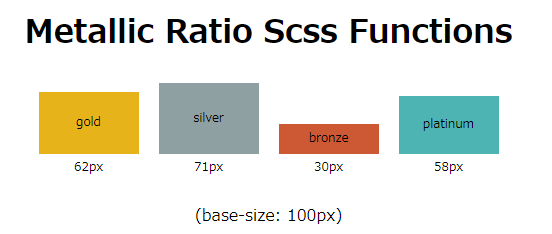

# Usage

Calculating Four Metallic Ratios.
（黄金比、白銀比、青銅比、白金比を算出します。）



## Setup

```command
yarn add node-sass metallic_number
```

<!-- ## Change Info -->

```scss
@import "~metallic_number/index.scss";

.gold {
    height: ratio(g, 100px); // g or gold or golden
    // = height: 62px
}

.silver {
    height: ratio(s, 100px); // s or silver
    // = height: 71px
}

.bronze {
    height: ratio(b, 100px); // b or bronze
    // = height: 30px
}

.platinum {
    height: ratio(p, 100px); // p or platinum
    // = height: 58px
}
```

| metal  |          arguments          |        ratio        |
| ------ | --------------------------- | ------------------- |
| 黄金比 | __gold__, __golden__, __g__ | __* 0.61803398875__ |
| 白銀比 | __silver__, __s__           | __* 0.70710678118__ |
| 青銅比 | __bronze__, __b__           | __* 0.30277563773__ |
| 白金比 | __platinum__, __p__         | __* 0.57735026918__ |
